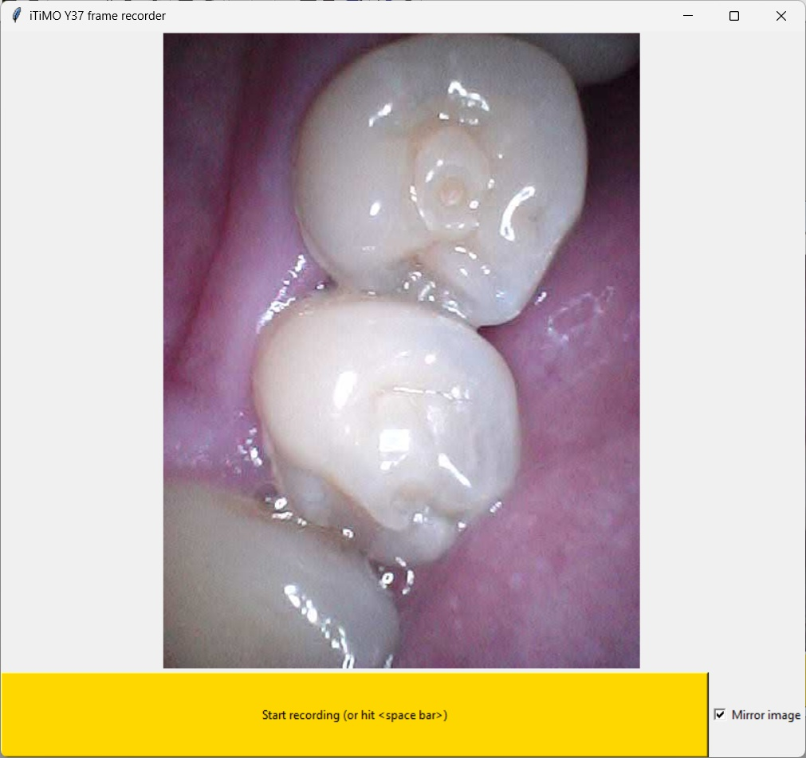
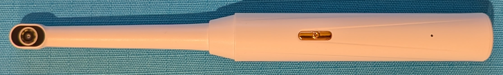
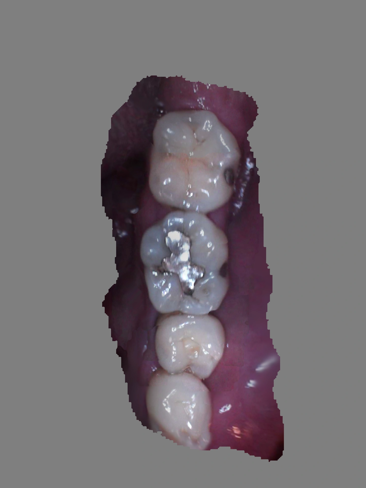
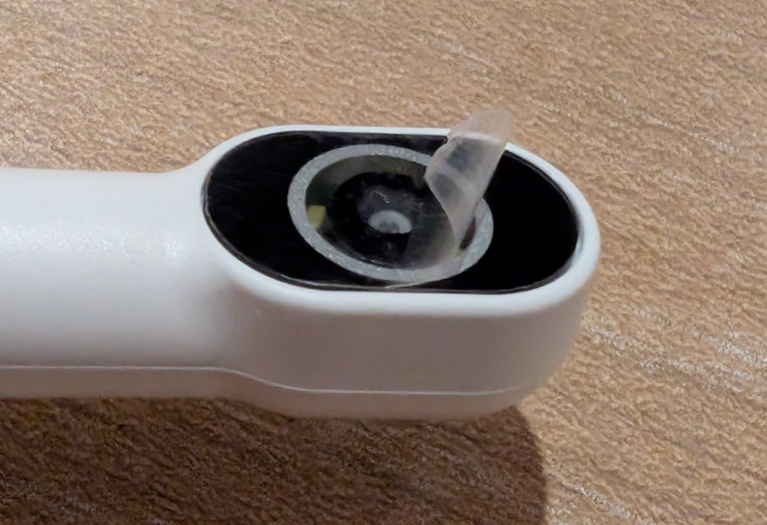
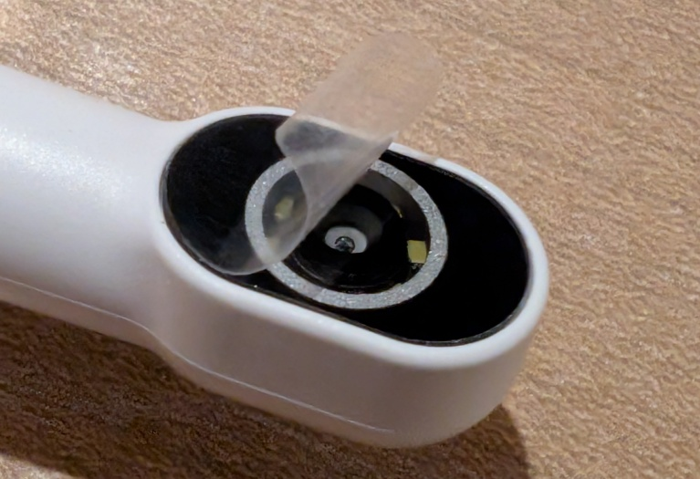

# View and record Dental Camera video stream frames as a sequence of JPEG images

Screenshot of GUI 

Dental Camera 

Example sequence of recorded frame images 

Author: [Mark Hsieh](https://github.com/mcmhsieh)

## Acknowledgements
 * Substantially based on [freed-borescope](https://github.com/framenic/freed-borescope) by [framenic](https://github.com/framenic)

## Purpose

The recorded frames are saved to a directory as individual JPEG images files, which makes them readily viewable and selectable as input for my research project: https://github.com/mcmhsieh/Smile (currently under development), to generate systhesised views by stitching together the collection of frame images.

Example synthesised view generated from the sequence of recorded frames 

## About the Dental Camera

Bought from an online marketplace with printed labels stuck on the packaging with the following information:
- Y37-WHITE
- Handheld 1080P WiFi Endoscope Oral Camera with 8 LED Lights
- Manufacturer: Shenzhen Zhiyi Technology Co., Ltd

The instructions do not refer to any identification other than directing the user to use an app called "ITIMO" on Google Play or Apple App store.

Its Wifi SSID is "iTiMO-*xxxxxx*", and the manufacturer/model/hardware information it returns once connected is "MoLink Technology/iTiMO-0877/1.0.0".

There is further information about the family of these devices in the [README of framenic's freed-borescope repository](https://github.com/framenic/freed-borescope/blob/main/README.md).

The clarity of the captured images can be improved by removing the clear plastic overlay film covering the LEDs and camera lens on the Dental Camera device, although the the instructions accompanying the device do not appear mention the presence of the film. 

The device's MJPEG stream comprises 480 x 640 pixel images at a rate of approximately 16.7 FPS. At some point in the future it may be useful to augment recorded data with readings from its internal gyroscope.

The frame recorder utility lowers the LED PWM setting from 100 to 65 to reduce amount of overexposure at close proximity (causing undesirable pixel value saturation and clipping).

## Usage (Microsoft Windows)

- Clone https://github.com/mcmhsieh/iTiMO-Y37-frame-recorder.git or download a copy of the repository
- Install Python 3.11
- Create a virtual environment and activate it
- Install Python Poetry and use it to install the dependencies specified in [poetry.lock](poetry.lock)
- Power on the Dental Camera device and set the LED brightness to the dimmest setting
- Connect to the Dental Camera device's WiFi ("iTiMO-*xxxxxx*")
  - Optionally set the WiFi connection as a private connection
  - Either manually add a system firewall inbound permission rule for python.exe, or add it when e.g. Windows Defender Firewall automatically prompts with a popup dialog during the first-time startup of the frame recorder utility
  - Optionally add an IPv4 route for 192.168.1.1 to the WiFi interface (in an elevated command prompt) if the system is connected to another router (e.g. via Ethernet) that is also at 192.168.1.1
- Run the frame recorder utility in the activated virtual environment `python.exe frame_recorder.py`
- Click the "Start recording" button (or hit space bar key) to start and stop recording images to the `./recorded_frames` subdirectory

## License

[GNU General Public License v3.0](LICENSE)
